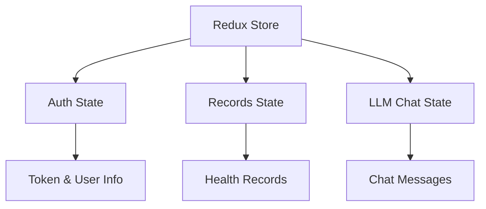

# VitaNote Architecture

## Domain-Driven Design (DDD)

VitaNote uses a layered architecture with Domain-Driven Design principles.

### Layers

1. **Domain Layer** (Core Business Logic)
   - Models: User, HealthRecord, FoodRecord, Profile
   - Value Objects: WeightRecordValue, GlucoseRecordValue, BloodPressureRecordValue
   - Repositories: IUserRepository, IHealthRecordRepository, etc.

2. **Application Layer** (Use Cases & Services)
   - Services: AuthService, HealthRecordService, OcrService, LlmService
   - DTOs: Request/Response objects for API communication
   - Validators and Rules

3. **Infrastructure Layer** (Technical Details)
   - Database: EF Core DbContext, Repositories
   - Storage: FileStorageService
   - External Services: LLM OCR Service

4. **Web API Layer** (Presentation)
   - Controllers: AuthController, HealthRecordsController, OcrController, LlmController
   - DTOs: API request/response models
   - Filters and Middlewares

### EntityRelationships

```
User
├── HealthRecords (1:N)
├── FoodRecords (1:N)
└── Profile (1:1)

HealthRecord
├── Type: Weight/Glucose/BloodPressure
└── PhotoPath (optional)

FoodRecord
├── UserId (Foreign Key)
└──PhotoPath (optional)
```

## Authentication Flow

1. User registers or logs in via `/auth/register` or `/auth/login`
2. JWT tokens are generated and returned
3. Frontend stores tokens in Zustand store
4. All API requests include Bearer token
5. Refresh token flow for token expiration

## Photo Processing Flow

1. Capture photo from mobile or web camera
2. Convert to Base64
3. Upload to `/api/upload/image` or `/api/ocr/extract-text`
4. Backend processes via LLM OCR (Ollama or OpenAI)
5. Extracted data parsed and returned
6. For food: Nutrition information extracted
7. For health devices: Values extracted from device display

## State Management (Frontend)



## Database Schema

### Tables

1. **Users**
   - Id, UserName, Email, PasswordHash
   - SecurityStamp, ConcurrencyStamp
   - CreatedAt, UpdatedAt

2. **HealthRecords**
   - Id, UserId, RecordType
   - Data (JSON)
   - PhotoPath
   - CreatedAt

3. **FoodRecords**
   - Id, UserId, FoodName
   - Calories, Protein, Carbohydrates, Fat
   - PhotoPath
   - CreatedAt

4. **Profiles**
   - Id, UserId
   - Gender, BirthDate, Height
   - ActivityLevel, Goals

## API Endpoints

### Authentication
- POST `/api/auth/register`
- POST `/api/auth/login`
- POST `/api/auth/logout`

### Health Records
- GET `/api/health-records/{type}`
- POST `/api/health-records/{type}`

### OCR
- POST `/api/ocr/extract-text`
- POST `/api/ocr/detect-food`
- POST `/api/ocr/detect-health-data`

### LLM
- POST `/api/llm/chat`
- POST `/api/llm/advice`

## Security Considerations

1. JWT tokens with short expiration
2. Password hashing with BCrypt
3. CORS configured for specific origins
4. HTTPS enforced in production
5. User input validation
6. SQL injection prevention via EF Core
7. File upload validation

## Performance Optimizations

1. EF Core query optimization with NoTracking
2. Database indexes on foreign keys
3. Caching strategy (TODO)
4. Image compression before upload
5. Pagination for large datasets

## Scalability

1. Database connection pooling
2. Stateless API servers
3. CDN for static assets
4. Load balancer support
5. Container orchestration (Kubernetes)
